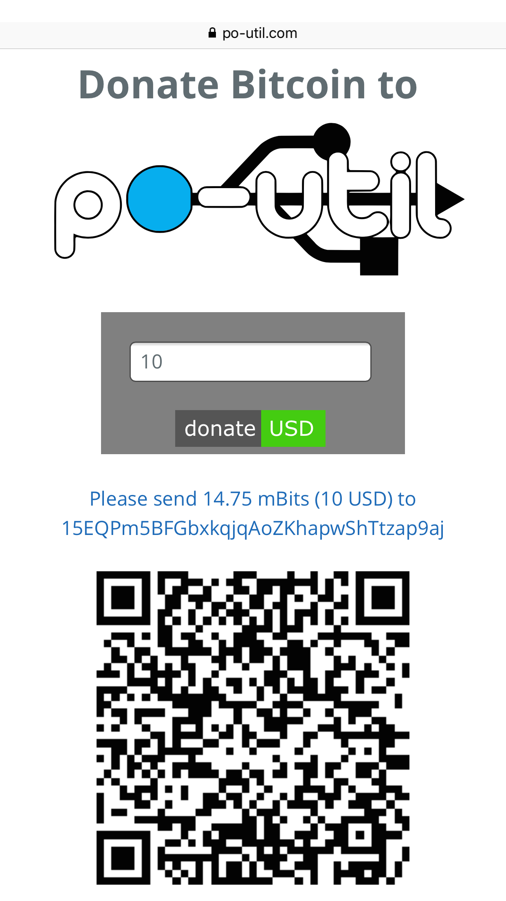

[](https://nrobinson2000.herokuapp.com/)
[](https://nrobinson2000.github.io/donate-bitcoin)
# donate-bitcoin
###### Copyright (GPL) 2016  Nathan Robinson
A simple html plugin to allow people to donate the equivalent bitcoin amount of a donation of a chosen fiat currency.

[Click here for a Demo.](http://nrobinson2000.github.io/donate-bitcoin/)

# Configuration: (inside of index.js)
```
var address = "PUT_ADDRESS_HERE"; // The bitcoin address to receive donations. Change to yours
var popup = false; // Set to true if you want a popup to pay bitcoin
var currency_code = "USD"; // Change to your default currency. Choose from https://api.bitcoinaverage.com/ticker/
var qrcode = true; // Set to false to disable qrcode
var link = true; // Set to false to disable generating hyperlink
var organization = "Example"; // Change to your organization name
var mbits = true; // Set to false to display bitcoin traditionally

```

# Use:
* Link people to your donate-bitcoin page to let them chose how much Bitcoin to donate.
* Link people to your donate-bitcoin page with a set amount and specific currency for them to donate.  This is done by adding something like `?amount=100&currency=USD` to your url. ([Example](https://nrobinson2000.github.io/donate-bitcoin/?amount=100&currency=USD))  Read more in the [Advanced Configuration.](https://github.com/nrobinson2000/donate-bitcoin#advanced-configuration)

# Screenshot:
<p align="center">

</p>

# Create a donation button:
To create a cool button like this, [](https://nrobinson2000.github.io/donate-bitcoin/?amount=10&currency=USD), you can use the [shields.io](http://shields.io) API.

#### Markdown:
```
[](http://example.com/donate-bitcoin/?amount=10&currency=USD)
```

#### HTML:
```
<a href="http://example.com/donate-bitcoin/?amount=10&currency=USD"></a>
```

# Embed:
You can use HTML to embed donate-bitcoin into one of your existing pages to add an option for people to donate right on your page.
```
<iframe style="border:none;" src="donate-bitcoin/index.html" height="600px" width="400px"></iframe>
```
Or with QR code option disabled:
```
<iframe style="border:none;" src="donate-bitcoin/index.html" height="200px" width="400px"></iframe>
```

A demo of donate-bitcoin being embedded can be found on my portfolio. [https://nrobinson2000.github.io/about/](https://nrobinson2000.github.io/about/)

# Advanced Configuration:
You can override any of the variables for donate-bitcoin by adding the parameters in your URL.  Different variables are separated with a `&`.  For example, to donate 10 Pounds Sterling to Satoshi Nakamoto, you would add:
```
/?amount=10&currency=GBP&name=Satoshi-Nakamoto
```
to your URL.  [See this example in action.](https://nrobinson2000.github.io/donate-bitcoin/?amount=10&currency=GBP&name=Satoshi-Nakamoto)

### Variables that you can set:

* **`amount`** - Set the amount of currency to donate.
* **`address`** - Set a Bitcoin address.
* **`popup`** - Enable / Disable popup. (`true` or `false`)
* **`currency`** - Set currency. (Chose from the [Bitcoin average API](https://api.bitcoinaverage.com/ticker/))
* **`qrcode`** - Enable / Disable QR code. (`true` or `false`)
* **`link`** - Enable / Disable Hyperlink. (`true` or `false`)
* **`name`** - Set your name. ( "Donate Bitcoin to NAME") **Separate words with `-`, use `--` for a `-` !**
* **`mbits`** - Display bitcoin donation in mBits. (Milli-Bitcoins) (`true` or `false`)

# Custom Examples of `donate-bitcoin`:
I have installed `donate-bitcoin` on my [po-util website](https://po-util.com), at [`https://po-util.com/donate`](https://po-util.com/donate)

Here is what it looks like on an iPhone 6 Plus:

<p align="center">

</p>
